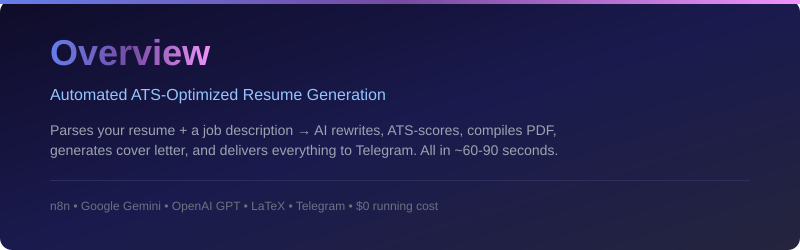
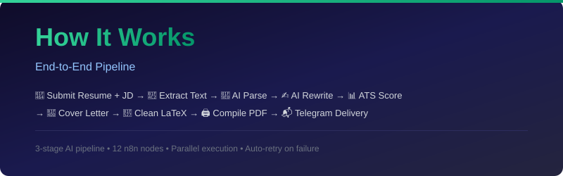
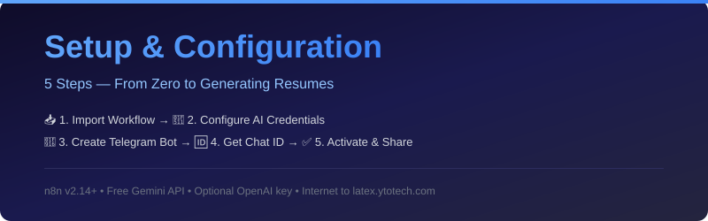
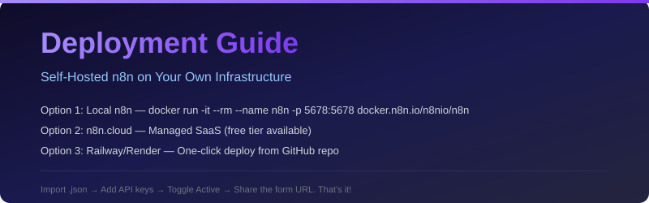
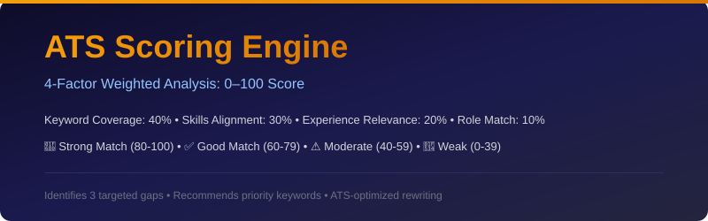

# 🤖 AI Resume Optimizer — n8n Workflow 🚀

> **Automatically parse your resume, analyze a job description, and generate a fully ATS-optimized, JD-tailored PDF resume** — powered by **Google Gemini** + **OpenAI GPT**, and delivered via **Telegram**. Zero manual effort. Zero cost to run. 💸

---

## 📌 Table of Contents

- [✨ Overview](#-overview)
- [🎬 Live Demo](#-live-demo)
- [⚙️ How It Works](#️-how-it-works)
- [🗺️ Workflow Architecture](#️-workflow-architecture)
- [🔩 Node-by-Node Breakdown](#-node-by-node-breakdown)
- [🤖 Supported AI Models](#-supported-ai-models)
- [📋 Prerequisites](#-prerequisites)
- [🛠️ Setup & Configuration](#️-setup--configuration)
- [🚀 Running the Workflow](#-running-the-workflow)
- [📦 Deployment](#-deployment)
- [📊 ATS Scoring Engine](#-ats-scoring-engine)
- [📝 Cover Letter Generator](#-cover-letter-generator)
- [💡 Enhancement Ideas](#-enhancement-ideas)
- [🔧 Troubleshooting](#-troubleshooting)
- [🧠 How the AI Optimization Works](#-how-the-ai-optimization-works)
- [📄 License](#-license)
- [👤 Author](#-author)

---

## ✨ Overview

<p align="center">
  
</p>

This **n8n automation workflow** takes your existing resume (PDF or DOCX) and a job description, then does all the heavy lifting — fully automatically! 🦾

### 🎯 What It Does

| Feature | Description | Status |
|---------|-------------|--------|
| 📄 **Resume Extraction** | Extracts structured data from your resume using AI | ✅ |
| 🧠 **JD Intelligence** | Analyzes job description for ATS keywords & priority signals | ✅ |
| ✍️ **Smart Rewriting** | Rewrites resume content — bullets, summary, skills — to match JD naturally | ✅ |
| 🖨️ **LaTeX PDF Compilation** | Compiles a clean, professional PDF using pdflatex | ✅ |
| 📬 **Telegram Delivery** | Delivers final PDF + Cover Letter directly to your chat | ✅ |
| 📊 **ATS Scoring** | Scores your resume match % with gap analysis | ✅ |
| 📝 **Cover Letter Gen** | Generates a tailored HTML cover letter | ✅ |

### 🏆 Why This Workflow?

- ✅ **No paid APIs** — Free Google Gemini + OpenAI tier is enough
- ✅ **No cloud subscriptions** — Just your own n8n instance
- ✅ **Zero manual effort** — Upload & forget, results come to your Telegram
- ✅ **ATS-optimized** — Every resume passes through strict ATS parsing rules
- ✅ **Open Source** — Fork it, tweak it, make it yours!

---

## 🎬 Live Demo

> Watch the n8n workflow process a resume step-by-step — from form submission to Telegram delivery.

<p align="center">
  <a href="assets/workflow-demo.html">
    
  </a>
  <br/>
  <em>👆 Click the image above to launch the interactive workflow simulation</em>
</p>

<p align="center">
  <a href="AI_Resume_Optimizer_Presentation.pptx">
    
  </a>
</p>

---

## ⚙️ How It Works

<p align="center">
  
</p>

```
User submits Resume + Job Description via Web Form
           │
           ▼
   📂 Extract text from Resume (PDF/DOCX)
           │
           ▼
   🧠 AI: Parse Resume → Structured JSON
           │
           ▼
   🧠 AI: Parse Job Description → Structured JSON
           │
           ▼
   ✍️  AI: Generate ATS-optimized LaTeX Resume
           │
           ▼
   🔧 Code: Clean & prepare LaTeX for compilation
           │
           ▼
   🖨️  API: Compile LaTeX → PDF (latex.ytotech.com)
           │
           ▼
   📬 Telegram: Send PDF + Cover Letter + ATS Score
```

### 🏗️ Visual Architecture

```
┌─────────────────────────────────────────────────────────────────┐
│                    AI RESUME OPTIMIZER                          │
├─────────────────────────────────────────────────────────────────┤
│                                                                 │
│  ┌──────────────┐    ┌────────────────┐    ┌────────────────┐   │
│  │ 💻 Form       │───▶│ 📂 Extract     │───▶│ 🧠 Resume      │   │
│  │ Trigger       │    │ From File      │    │ Extractor      │   │
│  └──────────────┘    └────────────────┘    └───────┬────────┘   │
│                                                     │           │
│                                                     ▼           │
│  ┌──────────────┐    ┌────────────────┐    ┌────────────────┐   │
│  │ 🧠 JD         │◀───│ 🔀 Merge/Wait  │◀───│ Both JSONs     │   │
│  │ Extractor     │    │                │    │ Ready          │   │
│  └───────┬───────┘    └────────────────┘    └───────┬────────┘   │
│          │                                          │           │
│          └──────────────────┬───────────────────────┘           │
│                             ▼                                   │
│              ┌─────────────────────────────┐                    │
│              │    Three Parallel Paths:    │                    │
│              │  ┌───────────────────────┐  │                    │
│              │  │ ① ✍️ LaTeX Resume Gen│  │                    │
│              │  │ ② 📊 ATS Score Agent │  │                    │
│              │  │ ③ 📝 Cover Letter Gen│  │                    │
│              │  └───────────────────────┘  │                    │
│              └─────────────┬───────────────┘                    │
│                            ▼                                    │
│              ┌────────────────────────────┐                     │
│              │  🔧 Prepare Compilation   │                     │
│              │  🖨️ Compile LaTeX → PDF   │                     │
│              │  📬 Build Telegram Msg    │                     │
│              └──────────────┬─────────────┘                     │
│                             ▼                                   │
│              ┌────────────────────────────┐                     │
│              │   📬 Telegram Delivery     │                     │
│              │   Resume PDF + Cover Letter│                     │
│              │   + ATS Score Report       │                     │
│              └────────────────────────────┘                     │
└─────────────────────────────────────────────────────────────────┘
```

---

## 🔩 Node-by-Node Breakdown

### 1️⃣ Resume & JD submitted — Form Trigger
A built-in n8n web form with two fields:
- 📎 **Resume** — file upload (accepts `.pdf` and `.docx`)
- 📋 **Job Description** — textarea for pasting the full JD

> 💡 The form URL is auto-generated by n8n and can be shared with anyone. Works on mobile too! 📱

---

### 2️⃣ Extract from File
Reads the uploaded resume binary and extracts plain text. Supports both PDF and DOCX formats via n8n's native `Extract From File` node.

> ⚠️ If your resume is a scanned image-only PDF (no selectable text), extraction will return empty. Use a text-based PDF or convert with OCR first.

---

### 3️⃣ Resume extractor — AI Agent
**Model:** Google Gemini / OpenAI GPT

Parses the extracted resume text into a detailed JSON object covering:
- 👤 Candidate identity, contact, online presence
- 🎯 Professional summary
- 🛠️ Skill matrix (grouped by category)
- 💼 Full work history with projects
- 🎓 Education, certifications, achievements

**Logic:**
- 🧩 Multi-role consolidation for career progression
- 🗺️ Project-to-employer mapping by date alignment
- 🔄 Two-column layout fragment reassembly
- 📅 Date standardization (Sept '21 → September 2021)

> 🛡️ Strict anti-hallucination rules — only returns what is explicitly in the document.

---

### 4️⃣ JD extractor — AI Agent
**Model:** Google Gemini / OpenAI GPT

Analyzes the raw job description text and extracts:
- 🏷️ Domain classification (15 categories)
- ⭐ Must-have vs. good-to-have skills
- 📋 Responsibility mapping (Core / Secondary / Strategic / Operational)
- 📊 Keyword priority ranking (High / Medium / Low)
- 💡 Resume optimization suggestions

> 🔍 **Detect-only** — no inference, no hallucination, no bias.

---

### 5️⃣ Generated resume unformatted — AI Agent
**Model:** Google Gemini / OpenAI GPT

This is the **core intelligence node** 🧠. It receives both JSON objects and fills a complete, locked LaTeX skeleton with:
- ✅ Candidate's real content (no hallucination)
- ✅ Experience bullets rewritten with strong action verbs
- ✅ JD keywords injected naturally throughout
- ✅ Skills reordered by JD priority
- ✅ ATS-compliant formatting

> Outputs a complete, compilable LaTeX document — ready for pdflatex!

---

### 6️⃣ Prepare compilation ready — Code (JavaScript)
Cleans the LLM output before sending to the compiler:
- ✂️ Strips any markdown fences (`` ```latex ``) the LLM may have added
- 🧹 Slices from `\documentclass` to `\end{document}` — discards stray text
- 📛 Extracts candidate's name from Resume JSON for the filename
- 🧼 Sanitizes the name: `FirstName_LastName_Resume.pdf`
- 🔒 `JSON.stringify`s the full request body for safe escaping

---

### 7️⃣ Compile latex code — HTTP Request
**API:** [latex.ytotech.com](https://latex.ytotech.com) 🆓 (no API key required)
**Compiler:** pdflatex

| Setting | Value |
|---------|-------|
| Method | POST |
| URL | `https://latex.ytotech.com/builds/sync` |
| Content-Type | `application/json` |
| Retry | ✅ 3 retries, 5s wait |
| Response | PDF binary saved as `pdfData` |

---

### 8️⃣ Compile & convert to pdf file — Code (JavaScript)
Passes the binary PDF through untouched while attaching:
- 📄 `filename` — sanitized `Name_Resume.pdf`
- 👤 `candidateName` — for the Telegram caption

---

### 9️⃣ ATS Score Agent — AI Agent
**Model:** Google Gemini / OpenAI GPT
**Purpose:** Scores resume-to-JD match on a 0–100 scale

| Factor | Weight |
|--------|--------|
| 🔑 Keyword coverage (high-priority JD keywords found in resume) | 40% |
| 🎯 Skills alignment (must-have skills present) | 30% |
| ⏳ Experience relevance (years + domain match) | 20% |
| 🏷️ Role title alignment | 10% |

> Output: `{ "score": 85, "recommendation": "Strong Match", "gaps": [ ... ], "top_matching_keywords": [ ... ] }`

---

### 🔟 Cover Letter Agent — AI Agent
**Model:** Google Gemini / OpenAI GPT
**Purpose:** Writes a compelling, personalized HTML cover letter

| Paragraph | Content | Purpose |
|-----------|---------|---------|
| 1️⃣ | Strong hook with company/role reference | Grab attention |
| 2️⃣ | Why this role & company specifically | Show research |
| 3️⃣ | 2–3 strongest matching achievements (quantified) | Prove capability |
| 4️⃣ | Address biggest skill gap as learning narrative | Show growth mindset |
| 5️⃣ | Confident, action-oriented closing | Drive response |

> 🎨 Output is clean HTML with inline CSS — works in Gmail, Outlook, etc.

---

### 1️⃣1️⃣ Build Caption + Cover Letter — Code (JavaScript)
Constructs the Telegram caption with:
- 🟩 Visual score bar (`🟩🟩🟩🟩🟩🟩🟩🟩⬜⬜` for 80/100)
- 📊 ATS match score & recommendation
- 🔍 Top gap bullets
- 📎 Cover letter HTML saved as a `.html` file for the Telegram document

---

### 1️⃣2️⃣ Send resume via Telegram
**Operation:** Send Document
Sends the compiled PDF with a caption like:
```
🚀 Nitin Kumar — Resume Ready ✅

📊 ATS Match Score: 85/100
🟩🟩🟩🟩🟩🟩🟩🟩⬜⬜ Strong Match

🔍 Top Gaps to Address:
   1. Missing Kubernetes experience
   2. No cloud certification mentioned
   3. Leadership examples needed

📄 File: Nitin_Kumar_Resume.pdf
🤖 ATS-optimized & JD-matched
```

### 1️⃣3️⃣ Send Cover Letter via Telegram
Sends the generated HTML cover letter alongside the resume — all in one go! 🎉

---

## 🤖 Supported AI Models

The workflow supports **two AI providers** with fallback capability:

### 🟢 Google Gemini Family

| Model ID | Speed | Quality | Best For |
|----------|-------|---------|----------|
| `models/gemini-2.0-flash-lite-001` | ⚡⚡⚡ | ✅ | Resume/JD Parsing (fast) |
| `models/gemini-2.5-flash-image` | ⚡⚡⚡ | ✅✅ | Parsing + Reasoning |
| `models/gemini-3.1-flash-image-preview` | ⚡⚡ | ✅✅✅ | LaTeX Generation |
| `models/gemini-3-pro-image-preview` | ⚡ | ✅✅✅✅ | ATS Scoring, Cover Letter |

### 🔵 OpenAI Family

| Model ID | Speed | Quality | Best For |
|----------|-------|---------|----------|
| `gpt-5-mini` | ⚡⚡⚡ | ✅ | Fast parsing tasks |
| `gpt-5.4-image-2` | ⚡⚡ | ✅✅✅ | Advanced gen + reasoning |

> 💡 Models listed in `config.json` for reference. You can switch models by updating the node parameters in n8n.

---

## 📋 Prerequisites

| # | Requirement | Details |
|---|-------------|---------|
| 1️⃣ | **n8n installed** (self-hosted) | v2.14 or higher recommended |
| 2️⃣ | **Google Gemini API key** 🆓 | [Get one here](https://aistudio.google.com/app/apikey) |
| 3️⃣ | **OpenAI API key** (optional) | For GPT model fallback |
| 4️⃣ | **Telegram Bot** 🤖 | Created via [@BotFather](https://t.me/BotFather) |
| 5️⃣ | **Telegram Chat ID** | Your personal/group chat ID |
| 6️⃣ | **Internet access** 🌐 | To `latex.ytotech.com` & AI APIs |

---

## 🛠️ Setup & Configuration

<p align="center">
  
</p>

### Step 1 — Import the Workflow 📥

1. Open your n8n instance
2. Go to **Workflows** → click **Import**
3. Upload the `OptimizeResumeAsPerJD — Enhanced.json` file
4. The workflow will appear with all nodes pre-configured

### Step 2 — Configure Google Gemini Credential 🔑

1. In n8n, go to **Settings** → **Credentials** → **Add Credential**
2. Search for **Google PaLM API** (used for Gemini)
3. Paste your Gemini API key
4. Name it like `Google Gemini - Resume Optimizer`
5. In the workflow, assign this credential to all Gemini Chat Model nodes

> 💡 You can use the same credential for all nodes.

### Step 3 — Configure Telegram 📬

#### 3a — Create a Bot
1. Open Telegram → search for **@BotFather**
2. Send `/newbot` and follow the prompts
3. Copy the **Bot Token** you receive

#### 3b — Add Telegram Credential in n8n
1. Go to **Credentials** → **Add** → search **Telegram**
2. Paste your Bot Token → Save

#### 3c — Get Your Chat ID
1. Add your bot to a Telegram group, or start a direct chat
2. Send any message to the bot
3. Visit: `https://api.telegram.org/bot<YOUR_TOKEN>/getUpdates`
4. Find `"chat": {"id": ...}` in the response
5. For a **group**, the ID will be a negative number like `-5273070660`

#### 3d — Update Telegram Nodes
1. Click both `Send resume via telegram` and `Send Cover Letter via Telegram`
2. Set your **Chat ID** in the field
3. Assign your Telegram credential

### Step 4 — Activate the Workflow ✅

1. Toggle **Inactive** → **Active** (top-right corner)
2. Click the `Resume & JD submitted` Form Trigger node
3. Copy the **Production URL** — this is your public form URL 🎉

---

## 🚀 Running the Workflow

```bash
# 1. Open the form URL in any browser 🌐
# 2. Upload your resume (.pdf or .docx) 📎
# 3. Paste the full job description 📝
# 4. Click "Send ✅"
# 5. Wait ~60-90 seconds (3 AI calls + compilation) ⏳
# 6. Check Telegram — optimized PDF + Cover Letter + Score! 🎉
```

> 📱 **Pro Tip:** The form works on mobile too — share the URL with friends to generate their resumes!

### What You Get in Telegram:

| Item | Format | Description |
|------|--------|-------------|
| ✅ **ATS-Optimized Resume** | PDF | Tailored to the JD with ATS keywords |
| 📝 **Cover Letter** | HTML | Professional & personalized |
| 📊 **ATS Score Report** | In caption | Score + gaps to address |

---

## 📦 Deployment

<p align="center">
  
</p>

### Option 1: Local n8n (Docker) 🐳

Run n8n on your own machine with a single command:

```bash
docker run -it --rm \
  --name n8n \
  -p 5678:5678 \
  -v ~/.n8n:/home/node/.n8n \
  docker.n8n.io/n8nio/n8n
```

Then open `http://localhost:5678` → **Workflows** → **Import** → upload the `.json` file.

### Option 2: n8n.cloud (Managed) ☁️

1. Sign up at [n8n.cloud](https://n8n.cloud) (free tier available)
2. Create a new workflow → **Import** → upload the `.json` file
3. Configure credentials (Gemini, Telegram) in the UI

### Option 3: Railway / Render 🚂

Deploy from GitHub in one click:

| Platform | Link |
|----------|------|
| **Railway** | [](https://railway.app/new/template/n8n) |
| **Render** | [](https://render.com/deploy?repo=https://github.com/n8n-io/n8n) |

### Post-Deployment Checklist ✅

1. 🔑 Add **Google PaLM API** credential (for Gemini)
2. 🤖 Add **Telegram Bot** credential (from @BotFather)
3. 🆔 Set **Chat ID** in Telegram nodes
4. 🔗 Copy the **Production URL** from Form Trigger
5. 🚀 **Activate** the workflow

> 💡 All AI model configurations and credentials are managed through the n8n UI — no code changes needed!

---

## 📊 ATS Scoring Engine

<p align="center">
  
</p>

The ATS Score Agent uses a **4-factor weighted scoring model**:

### 🔢 Formula
```
ATS Score = (Keyword Coverage × 0.40) + (Skills Alignment × 0.30)
          + (Experience Relevance × 0.20) + (Role Title Match × 0.10)
```

### 📈 Score Interpretation

| Score Range | Recommendation | Visual |
|-------------|---------------|--------|
| 80–100 | 🚀 Strong Match | 🟩🟩🟩🟩🟩🟩🟩🟩🟩🟩 |
| 60–79 | ✅ Good Match | 🟩🟩🟩🟩🟩🟩🟩🟩⬜⬜ |
| 40–59 | ⚠️ Moderate Match | 🟩🟩🟩🟩🟩⬜⬜⬜⬜⬜ |
| 0–39 | 🔴 Weak Match | 🟩🟩🟩🟩⬜⬜⬜⬜⬜⬜ |

### 🎯 Gap Analysis
The engine identifies exactly **3 targeted, actionable gaps** — specific improvements for your resume.

---

## 📝 Cover Letter Generator

The Cover Letter Agent writes **5-paragraph HTML cover letters** designed for email delivery:

- 🎣 **Hook** — Strong opening referencing the company & role
- ❓ **Why This Role** — Show research & genuine interest
- 🏆 **Key Achievements** — 2-3 quantified wins from the resume
- 📚 **Addressing Gaps** — Skill gap turned into a learning narrative
- 🎬 **Closing CTA** — Confident, action-oriented ending

> No clichés, no placeholders, no hallucinations — just real, compelling content.

---

## 💡 Enhancement Ideas

These improvements can be added on top of the current working flow:

### 📧 Email Delivery (Gmail)
Add a **Gmail node** after `Compile & convert to pdf file` to send the PDF + Cover Letter as an email attachment. Great for sharing with recruiters directly.

### ⚡ Parallel AI Processing
Wire `Resume extractor` and `JD extractor` directly from `Extract from File` to run **in parallel** — cuts processing time by ~40%!

### 📨 Instant Acknowledgement
Add a Telegram/Gmail node right after the Form Trigger to send: *"✅ We've received your resume. Your optimized version will arrive in ~90 seconds."*

### 🔔 Error Alert via Telegram
Add an **Error Trigger** workflow that sends you a Telegram message with full error details when any node fails.

### 📊 Google Sheets Logging
Add a **Google Sheets node** to log: candidate name, JD domain, ATS score, timestamp — for usage tracking.

### 🌐 Multi-language Support
Detect resume language and generate the optimized resume in the candidate's preferred language.

### 🧪 A/B Testing Mode
Generate 2 resume versions with different keyword strategies and let you pick the best ATS score.

### 🏢 Company Research Agent
Add a web search node that researches the company before generating — produces even more tailored content.

### 💾 Version History
Store all generated resumes with version tracking — compare & revert anytime.

---

## 🔧 Troubleshooting

| Error | Likely Cause | Fix |
|-------|-------------|-----|
| `Missing \begin{document}` | LLM wrapped output in markdown fences | ✅ Auto-fixed by `Prepare compilation ready` node |
| `MISSING_COMPILATION_SPECIFICATION` | Double `==` in HTTP body expression | Use single `=`: `={{ $json.requestBody }}` |
| `XeTeXglyph` error | `fontawesome5` package used | Remove `\usepackage{fontawesome5}` from LaTeX skeleton |
| Empty PDF / blank resume | Scanned image PDF | Convert to text-based PDF first, or use DOCX format |
| Telegram bot not sending | Bot not added to group | Add bot to group and make it admin |
| Gemini API errors | Rate limit on free tier | Add a **Wait** node (5s) between AI agents |

---

## 🧠 How the AI Optimization Works

The workflow uses a **three-stage intelligence pipeline**:

### Stage 1 — Resume Intelligence 🎯
The resume extractor doesn't just copy-paste text. It consolidates multi-role employment histories, maps projects to employers by date, reassembles fragmented two-column layouts, and standardizes all date formats — all with strict anti-hallucination rules.

### Stage 2 — JD Intelligence 🎯
The JD extractor runs a **detect-only analysis**. It identifies high-priority keywords (marked "Required"/"Must"), classifies the domain, maps responsibility types, and generates a placement strategy — telling the next stage exactly which skills go in which resume section.

### Stage 3 — ATS-Optimized Generation 🎯
Armed with both structured JSONs, the LaTeX generator rewrites experience bullets with action verbs, injects JD keywords at the right density, reorders skills by JD priority, and outputs clean, compilable LaTeX — no hallucination, no invented facts.

---

## 📄 License

This workflow is **free to use, modify, and share**. If you build something cool with it, a shoutout is always appreciated! 🙌✨

<p align="center">
  <sub>Made with ❤️, ☕, too many LaTeX error logs, and the firm belief that your resume should work as hard as you do.</sub>
</p>

---

## 👤 Author

**Nitin Kumar**
🔗 [LinkedIn](https://www.linkedin.com/in/nitinkumar)
🔗 [GitHub](https://github.com/nitinkumar30)

> Built with ☕, too many LaTeX error logs, and the firm belief that your resume should work as hard as you do.

---

<p align="center">
  
  
  
  
  
</p>
