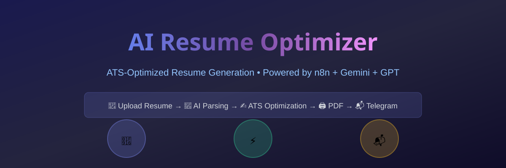
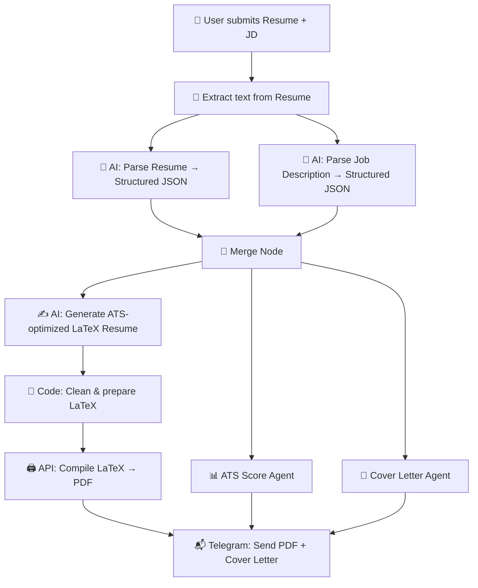
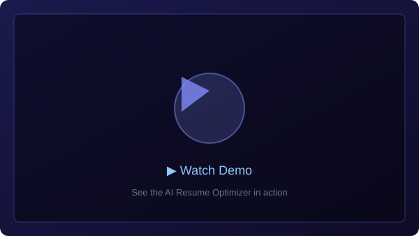
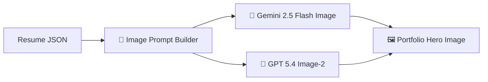
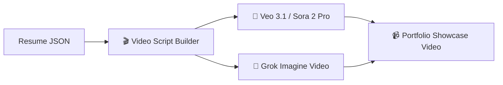

# 🤖 AI Resume Optimizer — n8n Workflow 🚀

> **Automatically parse your resume, analyze a job description, and generate a fully ATS-optimized, JD-tailored PDF resume** — powered by **Google Gemini**, **OpenAI GPT**, and delivered via **Telegram**. Zero manual effort. Zero cost to run. 💸

<p align="center">
  
</p>

---

## 📌 Table of Contents

- [✨ Overview](#-overview)
- [⚙️ How It Works](#️-how-it-works)
- [🗺️ Workflow Architecture](#️-workflow-architecture)
- [🎯 Demo Video](#-demo-video)
- [🔩 Node-by-Node Breakdown](#-node-by-node-breakdown)
- [🤖 Supported AI Models](#-supported-ai-models)
- [📋 Prerequisites](#-prerequisites)
- [🛠️ Setup & Configuration](#️-setup--configuration)
- [🚀 Running the Workflow](#-running-the-workflow)
- [🎨 Media Generation Pipeline](#-media-generation-pipeline)
- [📊 ATS Scoring Engine](#-ats-scoring-engine)
- [📝 Cover Letter Generator](#-cover-letter-generator)
- [💡 Enhancement Ideas](#-enhancement-ideas)
- [🔧 Troubleshooting](#-troubleshooting)
- [🧠 How the AI Optimization Works](#-how-the-ai-optimization-works)
- [📄 License](#-license)
- [👤 Author](#-author)

---

## ✨ Overview

This **n8n automation workflow** takes your existing resume (PDF or DOCX) and a job description, then does all the heavy lifting — fully automatically! 🦾

### 🎯 What It Does

| Feature | Description | Status |
|---------|-------------|--------|
| 📄 **Resume Extraction** | Extracts structured data from your resume using AI | ✅ |
| 🧠 **JD Intelligence** | Analyzes job description for ATS keywords & priority signals | ✅ |
| ✍️ **Smart Rewriting** | Rewrites resume content — bullets, summary, skills — to match JD naturally | ✅ |
| 🖨️ **LaTeX PDF Compilation** | Compiles a clean, professional PDF using pdflatex | ✅ |
| 📬 **Telegram Delivery** | Delivers final PDF + Cover Letter directly to your chat | ✅ |
| 📊 **ATS Scoring** | Scores your resume match % with gap analysis | ✅ |
| 📝 **Cover Letter Gen** | Generates a tailored HTML cover letter | ✅ |
| 🎨 **Media Generation** | Generates images & videos for portfolio enhancement | 🆕 |

### 🏆 Why This Workflow?

- ✅ **No paid APIs** — Free Google Gemini + OpenAI tier is enough
- ✅ **No cloud subscriptions** — Just your own n8n instance
- ✅ **Zero manual effort** — Upload & forget, results come to your Telegram
- ✅ **ATS-optimized** — Every resume passes through strict ATS parsing rules
- ✅ **Open Source** — Fork it, tweak it, make it yours!

---

## ⚙️ How It Works



### 📊 Visual Architecture

```
┌─────────────────────────────────────────────────────────────────┐
│                    AI RESUME OPTIMIZER                          │
├─────────────────────────────────────────────────────────────────┤
│                                                                 │
│  ┌──────────────┐    ┌────────────────┐    ┌────────────────┐   │
│  │ Form Trigger  │───▶│ Extract File   │───▶│ Resume Parser  │   │
│  │ (Web Form)    │    │ (PDF/DOCX)     │    │ (Gemini/GPT)   │   │
│  └──────────────┘    └────────────────┘    └───────┬────────┘   │
│                                                     │           │
│                                                     ▼           │
│  ┌──────────────┐    ┌────────────────┐    ┌────────────────┐   │
│  │ JD Parser     │◀───│  Wait/ Merge   │◀───│ Both JSONs     │   │
│  │ (Gemini/GPT)  │    │                │    │ Ready          │   │
│  └───────┬───────┘    └────────────────┘    └───────┬────────┘   │
│          │                                          │           │
│          └──────────────────┬───────────────────────┘           │
│                             ▼                                   │
│              ┌─────────────────────────────┐                    │
│              │    Three Parallel Agents:   │                    │
│              │  ┌───────────────────────┐  │                    │
│              │  │ ① LaTeX Resume Gen   │  │                    │
│              │  │ ② ATS Score Agent    │  │                    │
│              │  │ ③ Cover Letter Agent│  │                    │
│              │  └───────────────────────┘  │                    │
│              └─────────────┬───────────────┘                    │
│                            ▼                                    │
│              ┌────────────────────────────┐                     │
│              │    Compile PDF + Build     │                     │
│              │    Caption + Cover Letter  │                     │
│              └──────────────┬─────────────┘                     │
│                             ▼                                   │
│              ┌────────────────────────────┐                     │
│              │   📬 Telegram Delivery     │                     │
│              │   PDF + Cover Letter +     │                     │
│              │   ATS Score Report         │                     │
│              └────────────────────────────┘                     │
└─────────────────────────────────────────────────────────────────┘
```

---

## 🎯 Demo Video

> 🎬 **See it in action!**

<p align="center">
  <a href="assets/demo-video.mp4">
    
  </a>
  <br/>
  <em>Click the image above to watch the full walkthrough</em>
</p>

---

## 🔩 Node-by-Node Breakdown

### 1️⃣ Resume & JD submitted — Form Trigger
A built-in n8n web form with two fields:
- 📎 **Resume** — file upload (accepts `.pdf` and `.docx`)
- 📋 **Job Description** — textarea for pasting the full JD

> 💡 The form URL is auto-generated by n8n and can be shared with anyone. Works on mobile too! 📱

---

### 2️⃣ Extract from File
Reads the uploaded resume binary and extracts plain text. Supports both PDF and DOCX formats via n8n's native `Extract From File` node.

> ⚠️ **Gotcha:** If your resume is a scanned image-only PDF (no selectable text), extraction will return empty. Use a text-based PDF or OCR it first.

---

### 3️⃣ Resume extractor — AI Agent
**Supported Models:**
- 🟢 **Google Gemini** (`gemini-2.0-flash-lite-001` → `gemini-2.5-flash-image`)
- 🔵 **OpenAI GPT** (`gpt-5-mini` → `gpt-5.4-image-2`)

Parses the extracted resume text into a detailed JSON object covering:
- 👤 Candidate identity, contact, online presence
- 🎯 Professional summary
- 🛠️ Skill matrix (grouped by category)
- 💼 Full work history with projects
- 🎓 Education, certifications, achievements

> 🛡️ Uses strict anti-hallucination rules — only returns what is explicitly in the document.

---

### 4️⃣ JD extractor — AI Agent
**Supported Models:** Gemini / GPT

Analyzes the raw job description text and extracts:
- 🏷️ Domain classification & seniority level
- ⭐ Must-have vs. good-to-have skills
- 🔧 Technical & non-technical skills
- 📋 Responsibilities (core, secondary, strategic, operational)
- 📊 Priority keyword ranking (High / Medium / Low)
- 💡 Resume optimization suggestions

---

### 5️⃣ Generated resume unformatted — AI Agent
**Supported Models:** Gemini / GPT

This is the **core intelligence node** 🧠. It receives both JSON objects and fills a complete, locked LaTeX skeleton with:
- ✅ Candidate's real content (no hallucination)
- ✅ Experience bullets rewritten with strong action verbs
- ✅ JD keywords injected naturally throughout
- ✅ Skills reordered by JD priority
- ✅ ATS-compliant formatting

> Outputs a complete, compilable LaTeX document — ready for pdflatex!

---

### 6️⃣ Prepare compilation ready — Code (JavaScript)
Cleans the LLM output before sending to the compiler:
- ✂️ Strips any markdown fences (`` ```latex ``) the LLM may have added
- 🧹 Slices from `\documentclass` to `\end{document}`
- 📛 Extracts candidate's name for the filename
- 🧼 Sanitizes the name: `FirstName_LastName_Resume.pdf`
- 🔒 `JSON.stringify`s the full request body for safe escaping

---

### 7️⃣ Compile latex code — HTTP Request
**API:** [latex.ytotech.com](https://latex.ytotech.com) 🆓 (no API key required)
**Compiler:** pdflatex

| Setting | Value |
|---------|-------|
| Method | POST |
| URL | `https://latex.ytotech.com/builds/sync` |
| Content-Type | `application/json` |
| Response | PDF binary saved as `pdfData` field |

---

### 8️⃣ Compile & convert to pdf file — Code (JavaScript)
Passes the binary PDF through untouched while attaching:
- 📄 `filename` — sanitized `Name_Resume.pdf`
- 👤 `candidateName` — for the Telegram caption

---

### 9️⃣ ATS Score Agent — AI Agent
**Model:** Gemini / GPT  
**Purpose:** Scores resume-to-JD match on a 0–100 scale

**Scoring Breakdown:**
| Factor | Weight |
|--------|--------|
| 🔑 Keyword coverage (high-priority JD keywords found) | 40% |
| 🎯 Skills alignment (must-have skills present) | 30% |
| ⏳ Experience relevance (years + domain match) | 20% |
| 🏷️ Role title alignment | 10% |

> Output: `{ "score": 85, "recommendation": "Strong Match", "gaps": [...], "top_matching_keywords": [...] }`

---

### 🔟 Cover Letter Agent — AI Agent
**Model:** Gemini / GPT  
**Purpose:** Writes a compelling, personalized HTML cover letter

The cover letter includes:
1. 🎣 Strong, specific opening hook
2. ❓ Why this role & company specifically
3. 🏆 2–3 strongest matching achievements (quantified)
4. 📚 Addresses biggest skill gap as a learning narrative
5. 🎬 Confident, action-oriented closing

---

### 1️⃣1️⃣ Build Caption + Cover Letter — Code (JavaScript)
Constructs the Telegram caption with:
- 🟩 Visual score bar emoji (`🟩🟩🟩🟩🟩🟩🟩🟩⬜⬜` for 80/100)
- 📊 ATS match score & recommendation
- 🔍 Top gap bullets
- 📎 Cover letter HTML saved as `.html` file

---

### 1️⃣2️⃣ Send resume via Telegram
**Operation:** Send Document  
Sends the compiled PDF with a caption like:
```
🚀 Nitin Kumar — Resume Ready ✅

📊 ATS Match Score: 85/100
🟩🟩🟩🟩🟩🟩🟩🟩⬜⬜ Strong Match

🔍 Top Gaps to Address:
   1. Missing Kubernetes experience
   2. No cloud certification mentioned
   3. Leadership examples needed

📄 File: Nitin_Kumar_Resume.pdf
🤖 ATS-optimized & JD-matched
```

### 1️⃣3️⃣ Send Cover Letter via Telegram
Sends the generated HTML cover letter alongside the resume — all in one go! 🎉

---

## 🤖 Supported AI Models

The workflow now supports **multiple AI providers** simultaneously. You can choose which model to use for each stage:

### 🟢 Google Gemini Models

| Model ID | Use Case | Speed | Quality |
|----------|----------|-------|---------|
| `models/gemini-2.0-flash-lite-001` | Resume/JD Parsing | ⚡⚡⚡ | ✅ |
| `models/gemini-2.5-flash-image` | Resume/JD Parsing + Image Gen | ⚡⚡⚡ | ✅✅ |
| `models/gemini-3.1-flash-image-preview` | LaTeX Generation + Image | ⚡⚡ | ✅✅✅ |
| `models/gemini-3-pro-image-preview` | ATS Scoring, Cover Letter | ⚡ | ✅✅✅✅ |

### 🔵 OpenAI Models

| Model ID | Use Case | Speed | Quality |
|----------|----------|-------|---------|
| `gpt-5-mini` | Fast parsing tasks | ⚡⚡⚡ | ✅ |
| `gpt-5.4-image-2` | Advanced generation + Images | ⚡⚡ | ✅✅✅ |

### 🔀 OpenRouter

| Model ID | Use Case |
|----------|----------|
| `openrouter/auto` | Auto-routes to best available model |

### 🎬 Video Generation Models

| Model ID | Provider | Use Case |
|----------|----------|----------|
| `x-ai/grok-imagine-video` | xAI | Short portfolio video clips |
| `google/veo-3.1-fast` | Google | Fast video generation |
| `google/veo-3.1-lite` | Google | Lightweight video gen |
| `google/veo-3.1` | Google | Full quality video |
| `bytedance/seedance-2.0-fast` | ByteDance | Efficient video gen |
| `openai/sora-2-pro` | OpenAI | Professional video gen |

### 🖼️ Image Generation Models

| Model ID | Provider | Use Case |
|----------|----------|----------|
| `google/gemini-2.5-flash-image` | Google | Portfolio images |
| `google/gemini-3.1-flash-image-preview` | Google | Hero images, banners |
| `google/gemini-3-pro-image-preview` | Google | High-quality visuals |
| `openai/gpt-5.4-image-2` | OpenAI | Professional graphics |
| `openrouter/auto` | OpenRouter | Auto best model routing |

---

## 📋 Prerequisites

Before importing and running this workflow, make sure you have:

| # | Requirement | Details |
|---|-------------|---------|
| 1️⃣ | **n8n installed** (self-hosted) | v2.14 or higher recommended |
| 2️⃣ | **Google Gemini API key** 🆓 | [Get one here](https://aistudio.google.com/app/apikey) |
| 3️⃣ | **OpenAI API key** (optional) | For GPT models |
| 4️⃣ | **Telegram Bot** 🤖 | Created via [@BotFather](https://t.me/BotFather) |
| 5️⃣ | **Telegram Chat ID** | Your personal/group chat ID |
| 6️⃣ | **Internet access** 🌐 | To `latex.ytotech.com` & AI APIs |
| 7️⃣ | **Image/Video API keys** (optional) | For media generation pipeline |

---

## 🛠️ Setup & Configuration

### Step 1 — Import the Workflow 📥

1. Open your n8n instance
2. Go to **Workflows** → click **Import**
3. Upload the `OptimizeResumeAsPerJD — Enhanced.json` file
4. The workflow will appear with all nodes pre-configured

### Step 2 — Configure AI Credentials 🔑

#### Google Gemini
1. Settings → Credentials → Add Credential
2. Search: **Google PaLM API**
3. Paste your Gemini API key
4. Name: `Google Gemini - Resume Optimizer`
5. Assign to all Gemini nodes

#### OpenAI (Optional)
1. Add **OpenAI API** credential
2. Paste your OpenAI API key
3. Assign to GPT nodes

### Step 3 — Configure Telegram 📬

#### 3a — Create a Bot
1. Open Telegram → search for **@BotFather**
2. Send `/newbot` and follow the prompts
3. Copy the **Bot Token** you receive

#### 3b — Add Telegram Credential
1. Go to **Credentials** → **Add** → search **Telegram**
2. Paste your Bot Token → Save

#### 3c — Get Your Chat ID
1. Add your bot to a Telegram group, or start a direct chat
2. Send any message to the bot
3. Visit: `https://api.telegram.org/bot<YOUR_TOKEN>/getUpdates`
4. Find `"chat": {"id": ...}` in the response
5. For a **group**, the ID will be a negative number like `-5273070660`

#### 3d — Update Telegram Nodes
- Set **Chat ID** in both Telegram nodes (`Send resume via telegram` & `Send Cover Letter via Telegram`)

### Step 4 — Activate the Workflow ✅

1. Toggle **Inactive** → **Active** (top-right corner)
2. Click the `Resume & JD submitted` Form Trigger node
3. Copy the **Production URL** — this is your public form URL 🎉

---

## 🚀 Running the Workflow

```bash
# 1. Open the form URL in any browser 🌐
# 2. Upload your resume (.pdf or .docx) 📎
# 3. Paste the full job description 📝
# 4. Click "Send ✅"
# 5. Wait ~60-90 seconds (3-5 AI calls + compilation) ⏳
# 6. Check Telegram — optimized PDF + Cover Letter + Score! 🎉
```

> 📱 **Pro Tip:** The form works on mobile too — share the URL with friends to generate their resumes!

### What You Get in Telegram:
| Item | Format | Description |
|------|--------|-------------|
| ✅ ATS-Optimized Resume | PDF | Tailored to the JD |
| 📝 Cover Letter | HTML | Professional & personalized |
| 📊 ATS Score Report | In caption | Score + gaps to address |

---

## 🎨 Media Generation Pipeline

> 🆕 **New!** Generate portfolio images & videos alongside your resume using cutting-edge AI models.

### Image Generation Workflow


### Video Generation Workflow


### Best Model Selection Guide

| Task | Recommended Model | Why |
|------|-------------------|-----|
| 🖼️ Resume Header Image | `google/gemini-2.5-flash-image` | Fast, good quality |
| 🖼️ Hero Banner | `google/gemini-3-pro-image-preview` | Highest quality |
| 🖼️ Skill Icons | `openai/gpt-5.4-image-2` | Professional look |
| 🎬 Short Clip (15s) | `x-ai/grok-imagine-video` | Quick generation |
| 🎬 Portfolio Video | `google/veo-3.1` | Best quality |
| 🎬 Professional Showcase | `openai/sora-2-pro` | Studio quality |
| 🎬 Fast Preview | `bytedance/seedance-2.0-fast` | Speed optimized |

---

## 📊 ATS Scoring Engine

The ATS Score Agent uses a sophisticated 4-factor scoring model:

### 🔢 Scoring Formula
```
ATS Score = (Keyword Coverage × 0.40) + (Skills Alignment × 0.30) 
          + (Experience Relevance × 0.20) + (Role Title Match × 0.10)
```

### 📈 Score Interpretation

| Score Range | Recommendation | Emoji |
|-------------|---------------|-------|
| 80–100 | 🚀 Strong Match | 🟩🟩🟩🟩🟩🟩🟩🟩🟩🟩 |
| 60–79 | ✅ Good Match | 🟩🟩🟩🟩🟩🟩🟩🟩⬜⬜ |
| 40–59 | ⚠️ Moderate Match | 🟩🟩🟩🟩🟩⬜⬜⬜⬜⬜ |
| 0–39 | 🔴 Weak Match | 🟩🟩🟩🟩⬜⬜⬜⬜⬜⬜ |

### 🎯 Gap Analysis
The engine identifies exactly **3 targeted gaps** — specific, actionable improvements for your resume.

---

## 📝 Cover Letter Generator

The Cover Letter Agent writes **5-paragraph HTML cover letters** designed for email delivery:

| Paragraph | Content | Purpose |
|-----------|---------|---------|
| 1️⃣ | Strong hook with company/role reference | Grab attention |
| 2️⃣ | Why this role & company | Show research |
| 3️⃣ | 2–3 quantified achievements | Prove capability |
| 4️⃣ | Address skill gaps as learning narrative | Show growth mindset |
| 5️⃣ | Confident, action-oriented closing | Drive response |

> 🎨 Output is clean HTML with inline CSS — works perfectly in Gmail, Outlook, and all major email clients.

---

## 💡 Enhancement Ideas

### ✅ Already Implemented
- [x] 🎨 **Image & Video Generation** — Portfolio media from resume data
- [x] 🤖 **Multi-Model Support** — Gemini + GPT + OpenRouter + Veo + Sora
- [x] 📊 **ATS Scoring** — Comprehensive match analysis
- [x] 📝 **Cover Letter Generator** — Personalized HTML cover letters
- [x] 🔄 **Retry on Fail** — Resilient HTTP calls

### 🚀 Future Enhancements

#### 📧 Email Delivery (Gmail)
Add a **Gmail node** to send the PDF + Cover Letter as an email attachment. Perfect for direct recruiter outreach!

#### ⚡ Parallel AI Processing
Wire `Resume extractor` and `JD extractor` directly from `Extract from File` to run **in parallel** — cuts processing time by ~40%!

#### 📨 Instant Acknowledgement
Add a Telegram/Gmail node right after the Form Trigger to send: *"✅ We've received your resume. Your optimized version will arrive in ~90 seconds."*

#### 🔔 Error Alert System
Add an **Error Trigger** workflow that sends you a Telegram message with full error details when any node fails.

#### 📊 Google Sheets Logging
Add a **Google Sheets node** to log: candidate name, JD domain, ATS score, timestamp — for usage tracking.

#### 🌐 Multi-language Support
Detect resume language & generate the optimized resume in the candidate's preferred language.

#### 🧪 A/B Testing Mode
Generate 2 resume versions with different keyword strategies and let you pick the best ATS score.

#### 🏢 Company Research Agent
Add a web search node that researches the company before generating — produces even more tailored content.

#### 📱 WhatsApp Delivery
Add WhatsApp Business API support as an alternative delivery channel.

#### 🔗 Direct Apply Integration
Connect to LinkedIn Easy Apply, Indeed, or other job platforms for one-click submission.

#### 💾 Version History
Store all generated resumes with version tracking — compare & revert anytime.

---

## 🔧 Troubleshooting

| Error | Likely Cause | Fix |
|-------|-------------|-----|
| `Missing \begin{document}` | LLM wrapped output in markdown fences | ✅ Auto-fixed by `Prepare compilation ready` node |
| `MISSING_COMPILATION_SPECIFICATION` | Double `==` in HTTP body expression | Use single `=` expression: `={{ $json.requestBody }}` |
| `XeTeXglyph` error | `fontawesome5` package used | Remove `\usepackage{fontawesome5}` from LaTeX skeleton |
| `join not defined` | Old template+data architecture | Ensure LaTeX goes directly to compiler, no split |
| Empty PDF / blank resume | Scanned image PDF | Convert to text-based PDF first, or use DOCX |
| Telegram bot not sending | Bot not added to group | Add bot to group and make it admin |
| Gemini API errors ⚠️ | Rate limit on free tier | Add **Wait** node (5s) between AI agents |
| Image generation fails | API key missing for model | Set correct API key in credential config |
| Video too long | Model context limit exceeded | Reduce video prompt to under 200 tokens |

---

## 🧠 How the AI Optimization Works

The workflow uses a **three-stage intelligence pipeline** — each stage powered by the best model for the job:

### 🎯 Stage 1 — Resume Intelligence
The resume extractor doesn't just copy-paste text. It:
- 🔗 Consolidates multi-role employment histories
- 🗺️ Maps projects to employers by date
- 🔄 Reassembles fragmented two-column layouts
- 📅 Standardizes all date formats

### 🎯 Stage 2 — JD Intelligence
The JD extractor runs a strict **detect-only analysis**:
- 🔍 Identifies high-priority keywords ("Required"/"Must")
- 🏷️ Classifies the domain
- 📋 Maps responsibility types
- 🧭 Generates a placement strategy — telling the next stage exactly where each skill goes

### 🎯 Stage 3 — ATS-Optimized Generation
Armed with both structured JSONs, the LaTeX generator:
- ✍️ Rewrites experience bullets with action verbs
- 🎯 Injects JD keywords at the right density
- 📊 Reorders skills by JD priority
- 🖨️ Outputs clean, compilable LaTeX
- 🛡️ No hallucination, no invented facts

---

## 📄 License

This workflow is **free to use, modify, and share**. If you build something cool with it, a shoutout is always appreciated! 🙌✨

<p align="center">
  <sub>Made with ❤️, ☕, too many LaTeX error logs, and the firm belief that your resume should work as hard as you do.</sub>
</p>

---

## 👤 Author

<p align="center">
  <strong>Nitin Kumar</strong><br/>
  <a href="https://www.linkedin.com/in/nitinkumar">
    
  </a>
  <a href="https://github.com/nitinkumar30">
    
  </a>
</p>

---

<p align="center">
  
  
  
  
  
  
</p>
